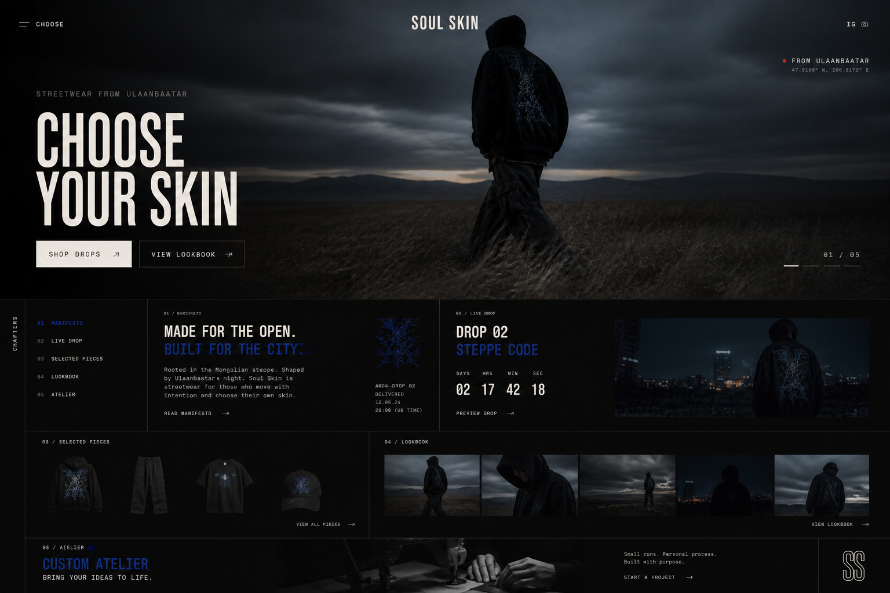
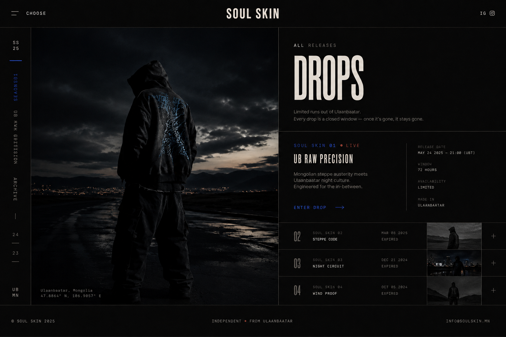
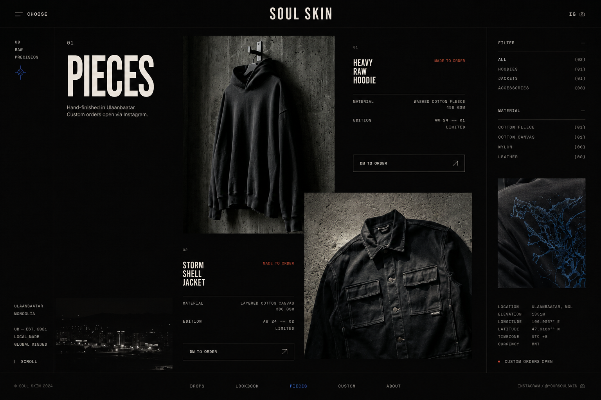
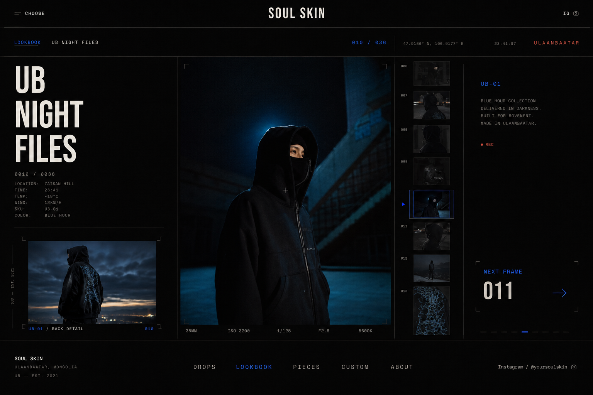
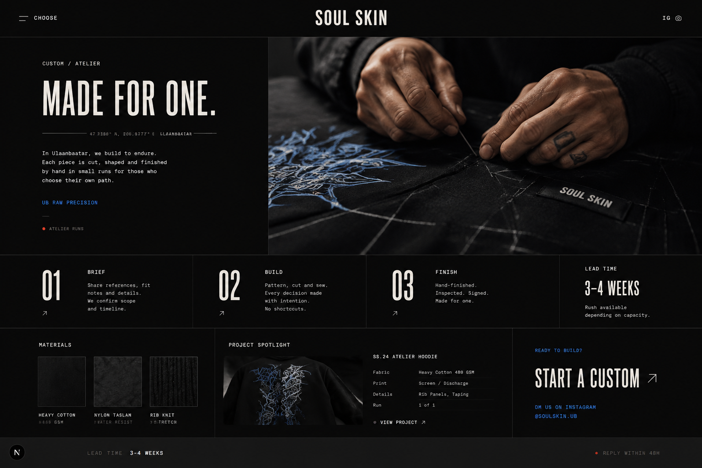
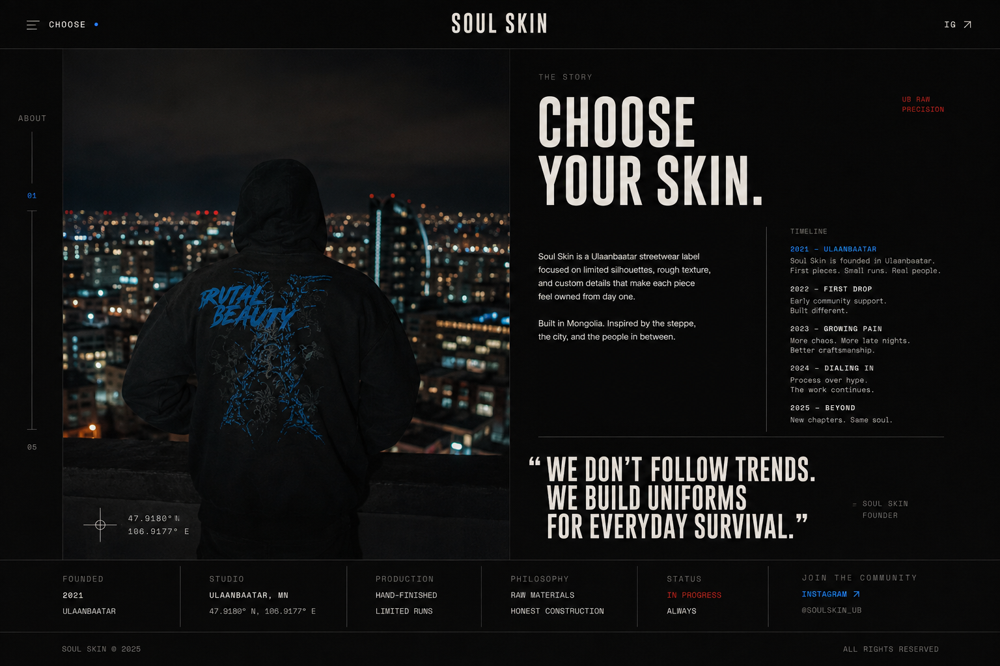

# Soul Skin Redesign Proposal

## Creative direction — UB RAW PRECISION

モンゴルの草原が持つ静けさと、ウランバートルの夜が持つ緊張感を、精密なエディトリアル・グリッドでひとつにする。ラグジュアリーを装飾で表現せず、写真、余白、素材情報、リリースの希少性でつくる。

現行サイトのダークな色調、中央の `SOUL SKIN`、`CHOOSE` メニュー、Hero のシネマティックな世界観はブランド資産として残す。改善の中心は、全ページの情報設計とページごとのリズムである。

> 生成ビジュアルはアートディレクションとレイアウトの提案。掲載文言、在庫、日付、価格、年表などは実装前に実データへ置き換える。

## 現状監査

### 強いところ

- Hero と商品写真だけでブランドの温度が伝わる。
- 黒、生成り、青の組み合わせに固有性がある。
- コンパクトな固定ナビとフルスクリーンメニューはブランドに合っている。
- Drops / Pieces / Lookbook のコンテンツ構造は小規模なレーベルに適している。

### 改善したいところ

- 下層ページの多くが「ラベル＋大見出し＋画像」の同じ構成で、移動しても体験が変わりにくい。
- 情報の階層が弱く、商品、リリース、カスタム制作への判断材料が不足している。
- 黒い余白が意図的な静けさではなく、未完成に見える箇所がある。特に Custom の初期表示が弱い。
- 小さなモノスペース文字と低コントラスト表示が多く、ブランド表現と読みやすさの境界を越えている。
- モバイルでは Hero は強いが、以降のコンテンツにも同じ精度の画像クロップ、余白、sticky CTA が必要。

## 共通デザインシステム

### 色

- Ink: `#090908` — 基本背景
- Bone: `#EEE9E2` — 大見出し、反転セクション、主要 CTA
- Iron: `#242321` — 面の差、パネル
- Mist: `#9B9892` — 本文、補助情報
- Electric cobalt: `#174CFF` — 選択状態、リンク、衣服グラフィックとの接続
- Rust signal: `#C54B37` — LIVE、REC、残数など状態表示だけに使用

### タイポグラフィ

- Display condensed: ページ名、声明、ナンバリング。大きく、短く使う。
- Neutral grotesk: 説明文。読みやすさを最優先する。
- Monospace: 日付、素材、座標、在庫、フレーム番号など「記録」に限定する。
- 英大文字は見出しとメタ情報に限定し、長文には使わない。

### レイアウト

- Desktop は 12-column、Mobile は 4-column。
- 1px の罫線をグリッドの骨格として使う。
- 横余白は Desktop 32–48px、Mobile 20–24px。
- セクション単位の均等な余白をやめ、映画のチャプターのように密度を変える。
- 角丸カード、ガラス表現、汎用的な EC カード UI は使わない。

### モーション

- Hero は現在の 2 秒ごとのシーン遷移を継続。軽いズームと露出変化だけに抑える。
- スクロール表示は 180–320ms、8–16px の移動で統一する。
- Hover は画像クロップ、罫線、青いインデックスの変化を中心にする。
- `prefers-reduced-motion` では静止画と即時切替へ落とす。

## ページ別提案

### 1. Home — fashion film + chapter index

Hero は現状の映像を主役にし、`CHOOSE YOUR SKIN`、2つの CTA、フレーム番号だけを明確にする。その直下を「ページの目次」にし、Manifesto / Live Drop / Selected Pieces / Lookbook / Atelier の5章をスクロールで追える構造へ変更する。

推奨構成:

1. Full-bleed film Hero
2. Chapter index + short manifesto
3. Live Drop takeover（日時・状態・残り期間）
4. Selected Pieces（商品画像を均等カードにしない）
5. Lookbook contact strip
6. Custom atelier wide CTA
7. 短く再設計した Footer

Mobile は CTA を縦積みし、Hero の人物と見出しが競合しない専用クロップを用意する。次セクションが 8–12% 見える高さにすると、スクロール可能性も自然に伝わる。

### 2. Drops — release ledger

Drops は商品一覧ではなく「リリースの記録」にする。左に固定感のあるキャンペーン写真、右にリリース名、公開日時、販売窓、状態、制作地を置く。過去 Drop は年／シーズンの縦レールと、展開可能なアーカイブ行にする。

追加すべき情報:

- Release date / order window
- LIVE / UPCOMING / ARCHIVED
- Edition または少量生産であること
- 収録アイテム数
- キャンペーンストーリー

Drop 詳細は、フル幅ギャラリー、短い声明、収録 Pieces、注文導線の順にする。実在しないカウントダウンや在庫数は出さない。

### 3. Pieces — collectible catalog

均一な商品カードをやめ、服の重量と素材が伝わる非対称グリッドへ。カテゴリと素材は細いフィルターレール、各 Piece には名称、素材、Edition、注文状態を常時表示する。画像は全景、着用、ディテールを混ぜる。

Piece 詳細の推奨構成:

- 70% ギャラリー + 30% sticky 情報パネル
- Fit / Fabric / Weight / Finish / Care
- One of one / Made to order / Limited run の明示
- Instagram の注文 CTA と、問い合わせ時に送るべき情報
- 関連 Piece ではなく「同じ Drop の Piece」を優先

Mobile は下部 sticky CTA を使うが、Instagram に遷移することをボタン内で明示する。

### 4. Lookbook — cinematic archive

現状の filmstrip の発想をさらに強くし、写真ギャラリーではなく撮影記録にする。大きな1フレーム、縦 filmstrip、撮影時刻・場所・気温・レンズなどのメタ情報、次フレームを一画面で構成する。

Desktop は左右キー、ホイール、クリックに対応。Mobile は縦スワイプのフルスクリーン章にし、サムネイルを無理に縮めない。画像読み込み時は次の1枚だけ先読みし、重い全件ロードを避ける。

### 5. Custom — atelier, not a text page

最も改善効果が大きいページ。初期表示から「手で作っている」ことが伝わる縫製・裁断・生地の接写を置き、`MADE FOR ONE.` と制作姿勢を短く見せる。本文だけではなく、工程と素材を証拠として見せる。

推奨構成:

1. Atelier split Hero
2. `01 BRIEF / 02 BUILD / 03 FINISH`
3. Lead time と対応範囲
4. Material swatches
5. 実在する過去制作の Project spotlight
6. `START A CUSTOM` CTA

注文フォームを新設する場合も、最初は名前、希望アイテム、サイズ、参考画像、希望時期だけに留める。Instagram 継続なら、DM に必要な情報を CTA 直前に示す。

### 6. About — brand essay

企業プロフィールではなく、Soul Skin がどこから生まれ、何を作り続けるのかを読むページにする。ウランバートルの夜景／人物を大きく使い、短いブランド声明、2021年からの実在する節目、制作地と生産方法、強い引用文で構成する。

数字や受賞歴を盛らず、`Ulaanbaatar / Hand-finished / Limited runs / Custom open` のような事実を信頼材料にする。最後は Instagram とコミュニティへの導線で終える。

## Navigation / Footer

現行の中央ロゴと `CHOOSE` は維持する。メニュー内ではページ名だけでなく、現在の Drop、Custom の受付状態を小さく表示する。現在地は青い点または縦線で示す。

Footer は巨大な繰り返しナビを避け、次の4要素へ整理する。

- Ulaanbaatar / established 2021
- 主要ナビ
- Instagram
- Current status: Drop / Custom

## 実装優先度

### Phase 1 — foundation + Home

- 色、文字、余白、罫線、ボタン、motion token を CSS 変数化
- Navbar / Footer の再設計
- Home の chapter 構成と Hero 下の情報設計
- Mobile Hero と reduced-motion 対応

### Phase 2 — commerce core

- Drops と Drop detail
- Pieces と Piece detail
- 状態、素材、制作情報のデータモデル整理
- 画像比率と最適化ルールの統一

### Phase 3 — brand depth

- Lookbook の film archive UI
- Custom の atelier コンテンツ
- About の brand essay
- Hover / focus / loading / empty / error state の仕上げ

## 完成基準

- 各ページをロゴなしで見ても役割が判別できる。
- 主要 CTA が各 viewport でひとつ明確に見える。
- 375px から 1600px まで横スクロールがない。
- キーボード操作、フォーカス表示、色コントラスト、reduced motion に対応する。
- Hero 以外は初期ロードを妨げず、画像サイズと先読みをページごとに制御する。
- DB 停止中でもローカルコンテンツで全ページのレイアウトが崩れない。

